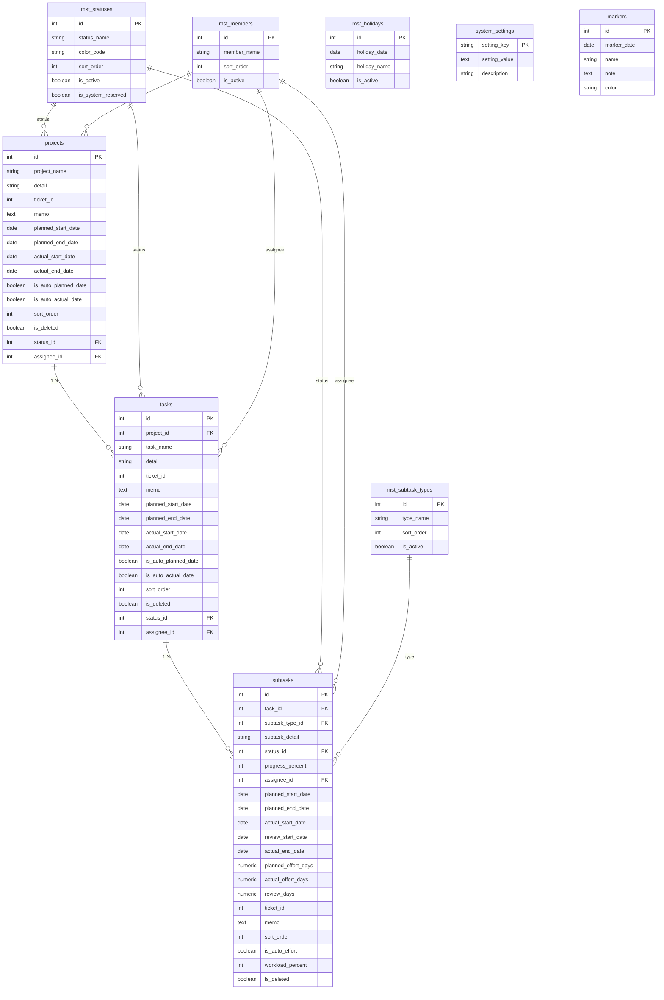

# データベース設計書 (Table Definition Document)

## 1. 概要
本ドキュメントは、WBS (Work Breakdown Structure) 管理ツールのデータベース設計の詳細をまとめたものです。
本システムは、プロジェクト、タスク、サブタスクの3階層で工程を管理し、ガントチャート表示や進捗管理、工数管理を行うことを目的としています。

### システム基盤
- **データベース管理システム**: PostgreSQL
- **ORM**: SQLAlchemy
- **マイグレーションツール**: Alembic

---

## 2. エンティティ・リレーションシップ図 (ERD)

---

## 3. テーブル定義

### 3.1. 業務データテーブル

#### `projects` (プロジェクト)
WBSの最上位階層。管理対象のプロジェクトを保持します。

| カラム名 | データ型 | PK/FK | Null | 初期値 | 説明 |
| :--- | :--- | :---: | :---: | :--- | :--- |
| id | Integer | PK | No | - | プロジェクトID |
| project_name | String(200) | - | No | - | プロジェクト名 |
| detail | String(300) | - | Yes | - | 詳細説明 |
| ticket_id | Integer | - | Yes | - | 外部チケットID (Redmine等) |
| memo | Text | - | Yes | - | 備考 |
| planned_start_date | Date | - | Yes | - | 計画開始日 |
| planned_end_date | Date | - | Yes | - | 計画終了日 |
| actual_start_date | Date | - | Yes | - | 実績開始日 |
| actual_end_date | Date | - | Yes | - | 実績終了日 |
| is_auto_planned_date | Boolean | - | No | True | 子要素から計画日を自動計算するか |
| is_auto_actual_date | Boolean | - | No | True | 子要素から実績日を自動計算するか |
| sort_order | Integer | - | No | 0 | 表示順 |
| is_deleted | Boolean | - | No | False | 削除フラグ |
| status_id | Integer | FK | Yes | - | `mst_statuses` 参照 |
| assignee_id | Integer | FK | Yes | - | `mst_members` 参照 (主担当者) |
| created_at | DateTime | - | No | now() | 作成日時 |
| updated_at | DateTime | - | No | now() | 更新日時 |

#### `tasks` (タスク)
プロジェクトに紐づく中項目。

| カラム名 | データ型 | PK/FK | Null | 初期値 | 説明 |
| :--- | :--- | :---: | :---: | :--- | :--- |
| id | Integer | PK | No | - | タスクID |
| project_id | Integer | FK | No | - | `projects` 参照 |
| task_name | String(200) | - | No | - | タスク名 |
| detail | String(300) | - | Yes | - | 詳細説明 |
| ticket_id | Integer | - | Yes | - | 外部チケットID |
| memo | Text | - | Yes | - | 備考 |
| planned_start_date | Date | - | Yes | - | 計画開始日 |
| planned_end_date | Date | - | Yes | - | 計画終了日 |
| actual_start_date | Date | - | Yes | - | 実績開始日 |
| actual_end_date | Date | - | Yes | - | 実績終了日 |
| is_auto_planned_date | Boolean | - | No | True | 子要素から計画日を自動計算するか |
| is_auto_actual_date | Boolean | - | No | True | 子要素から実績日を自動計算するか |
| sort_order | Integer | - | No | 0 | 表示順 |
| is_deleted | Boolean | - | No | False | 削除フラグ |
| status_id | Integer | FK | Yes | - | `mst_statuses` 参照 |
| assignee_id | Integer | FK | Yes | - | `mst_members` 参照 (担当者) |
| created_at | DateTime | - | No | now() | 作成日時 |
| updated_at | DateTime | - | No | now() | 更新日時 |

#### `subtasks` (サブタスク/工程)
タスクに紐づく最小単位の作業。工数や進捗率を直接管理します。

| カラム名 | データ型 | PK/FK | Null | 初期値 | 説明 |
| :--- | :--- | :---: | :---: | :--- | :--- |
| id | Integer | PK | No | - | サブタスクID |
| task_id | Integer | FK | No | - | `tasks` 参照 |
| subtask_type_id | Integer | FK | Yes | - | `mst_subtask_types` 参照 |
| subtask_detail | String(300) | - | Yes | - | 作業内容詳細 |
| status_id | Integer | FK | No | - | `mst_statuses` 参照 |
| progress_percent | Integer | - | Yes | 0 | 進捗率 (0-100) |
| assignee_id | Integer | FK | Yes | - | `mst_members` 参照 |
| planned_start_date | Date | - | Yes | - | 計画開始日 |
| planned_end_date | Date | - | Yes | - | 計画終了日 |
| actual_start_date | Date | - | Yes | - | 実績開始日 |
| review_start_date | Date | - | Yes | - | レビュー開始日 |
| actual_end_date | Date | - | Yes | - | 実績終了日 (完了日) |
| planned_effort_days | Numeric(8,2) | - | Yes | - | 計画工数 (人日) |
| actual_effort_days | Numeric(8,2) | - | Yes | - | 実績工数 (人日) |
| review_days | Numeric(8,2) | - | Yes | - | レビュー工数 (人日) |
| ticket_id | Integer | - | Yes | - | 外部チケットID |
| memo | Text | - | Yes | - | 備考 |
| sort_order | Integer | - | No | 0 | 表示順 |
| is_auto_effort | Boolean | - | No | True | 日付から工数を自動算出するか |
| workload_percent | Integer | - | No | 100 | 稼働率 (工数算出用) |
| is_deleted | Boolean | - | No | False | 削除フラグ |
| created_at | DateTime | - | No | now() | 作成日時 |
| updated_at | DateTime | - | No | now() | 更新日時 |

### 3.2. マスタデータテーブル

#### `mst_statuses` (状態マスタ)
PJ/タスク/サブタスクの進捗ステータス。

| カラム名 | データ型 | PK/FK | Null | 説明 |
| :--- | :--- | :---: | :---: | :--- |
| id | Integer | PK | No | ステータスID |
| status_name | String(50) | - | No | ステータス名 (例: 未着手, 進行中) |
| color_code | String(20) | - | No | ガントチャート等での表示色 (HEX) |
| sort_order | Integer | - | No | 表示順 |
| is_active | Boolean | - | No | 有効フラグ |
| is_system_reserved | Boolean | - | No | システム予約 (削除不可等) |

#### `mst_members` (メンバーマスタ)
作業担当者のリスト。

| カラム名 | データ型 | PK/FK | Null | 説明 |
| :--- | :--- | :---: | :---: | :--- |
| id | Integer | PK | No | メンバーID |
| member_name | String(100) | - | No | 名前 |
| sort_order | Integer | - | No | 表示順 |
| is_active | Boolean | - | No | 有効フラグ |

#### `mst_subtask_types` (工程種別マスタ)
サブタスクの作業種別（設計、開発、テスト等）。

| カラム名 | データ型 | PK/FK | Null | 説明 |
| :--- | :--- | :---: | :---: | :--- |
| id | Integer | PK | No | 種別ID |
| type_name | String(100) | - | No | 種別名 |
| sort_order | Integer | - | No | 表示順 |
| is_active | Boolean | - | No | 有効フラグ |

#### `mst_holidays` (祝日マスタ)
稼働日計算（工数算出）で使用する非稼働日のリスト。

| カラム名 | データ型 | PK/FK | Null | 説明 |
| :--- | :--- | :---: | :---: | :--- |
| id | Integer | PK | No | ID |
| holiday_date | Date | - | No | 祝日/休日日付 (Unique) |
| holiday_name | String(100) | - | No | 祝日名称 |
| is_active | Boolean | - | No | 有効フラグ |

### 3.3. 環境・設定テーブル

#### `system_settings` (システム設定)
アプリケーション全体の基本設定（チケットURLテンプレート等）。

| カラム名 | データ型 | PK/FK | Null | 説明 |
| :--- | :--- | :---: | :---: | :--- |
| setting_key | String(100) | PK | No | 設定キー |
| setting_value | Text | - | No | 設定値 |
| description | String(300) | - | Yes | 設定の説明 |

#### `markers` (マーカー)
ガントチャート上に表示するマイルストーン（期限や重要イベント）。

| カラム名 | データ型 | PK/FK | Null | 説明 |
| :--- | :--- | :---: | :---: | :--- |
| id | Integer | PK | No | マーカーID |
| marker_date | Date | - | No | 表示する日付 |
| name | String(100) | - | No | マーカー名 |
| note | Text | - | Yes | 備考 |
| color | String(20) | - | No | 表示色 |

#### `shared_filters` (共有フィルタ)
保存された検索・絞り込み条件。URLトークンによる共有用。

| カラム名 | データ型 | PK/FK | Null | 説明 |
| :--- | :--- | :---: | :---: | :--- |
| id | Integer | PK | No | ID |
| token | String(100) | - | No | アクセストークン (Unique) |
| filter_data | Text | - | No | JSON形式のフィルタ条件 |

---

## 4. テーブル間の関係（リレーション）と設計上の特徴

### 1. 階層構造と自動計算
- `projects` > `tasks` > `subtasks` の厳格な親子関係を持ちます。
- `is_auto_planned_date` / `is_auto_actual_date` が `True` の場合、親（PJ/タスク）の日付は子（タスク/サブタスク）の最小開始日と最大終了日によってバックエンド側で自動的にロールアップ計算されます。

### 2. 工数計算ロジック
- `subtasks` の `is_auto_effort` が `True` の場合、`planned_start_date` と `planned_end_date` の期間から、`mst_holidays`（休日）と `workload_percent`（稼働率）を考慮して `planned_effort_days` が自動計算されます。

### 3. 論理削除
- 主要なデータ（PJ, タスク, サブタスク）は `is_deleted` フラグによる論理削除を採用しています。

### 4. 制約 (Check Constraints)
- 空文字の禁止 (`name <> ''`)。
- 順序の非負 (`sort_order >= 0`)。
- 日付の整合性 (`end_date >= start_date`)。
- 進捗率の範囲 (`0 <= progress_percent <= 100`)。
